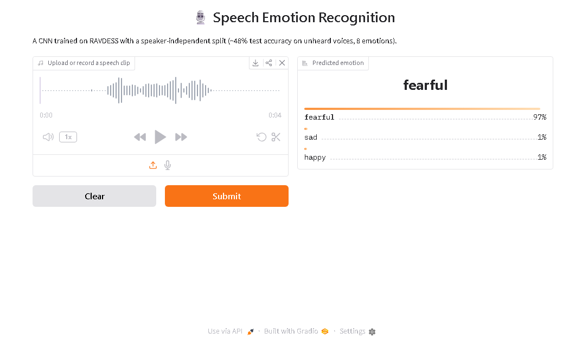
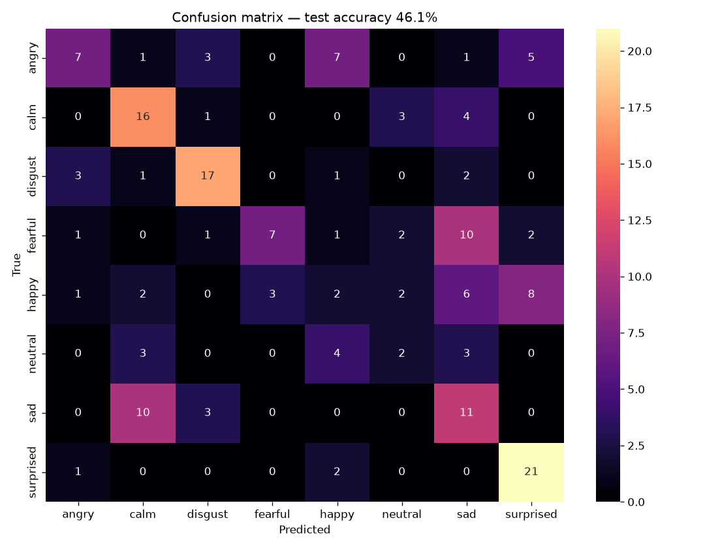

# 🎙️ Speech Emotion Recognition

Classify the emotion in a spoken audio clip (angry, calm, happy, sad, fearful, disgust,
neutral, surprised) by converting sound into mel-spectrograms and training a CNN.

> **Live demo:** https://speech-emotion-recognition-apc1.onrender.com
> _(free tier — the first request after idle takes ~1 min to wake up)_

## 🚀 Demo

Upload or record a clip → the model predicts the emotion with confidence scores.



**Try it yourself** (the app runs on ONNX Runtime, no PyTorch needed):

```bash
cd app
pip install -r requirements.txt
python app.py
```

Then open the local URL it prints (e.g. `http://127.0.0.1:7860`) and drop in a `.wav`
clip. A hosted version is linked at the top of this README.

## 🧠 How it works

1. **Audio → Spectrogram** — each clip becomes a mel-spectrogram with `librosa`,
   turning an audio problem into an image-classification problem.
2. **CNN classifier** — a 3-block convolutional network (Conv → BatchNorm → ReLU → MaxPool)
   learns the visual signatures of each emotion.
3. **Gradio app** — drag-drop a clip and get the predicted emotion. The trained model is
   exported to **ONNX** so the app runs on the lightweight `onnxruntime` (no PyTorch) for
   cheap deployment.

## 📊 Dataset

[RAVDESS](https://zenodo.org/record/1188976) — 1440 speech clips, 24 actors, 8 emotions.

## 🎯 Speaker-independent evaluation (the important bit)

Many tutorials shuffle clips randomly, which leaks the same **speaker** into both train
and test — so the model memorizes voices and reports inflated accuracy. Instead I split
**by actor**, so the test set contains **completely unheard voices**:

| Split | Actors | Clips |
|-------|--------|-------|
| Train | 1–19   | 1140  |
| Val   | 20–21  | 120   |
| Test  | 22–24  | 180   |

This gives an **honest** measure of how the model generalizes to new people.

## 📈 Results

- **Best validation accuracy:** 60.0%
- **Test accuracy (unseen speakers):** 46.1% across 8 classes (chance = 12.5%)

Regularization did the heavy lifting on this small, speaker-independent setup: a plain CNN
overfit badly (train ~99% vs val ~50%), so BatchNorm, weight decay, dropout, and SpecAugment
together closed most of that gap.



### What the errors reveal
The model's mistakes are **human-like** — it confuses emotions of similar *arousal*:
- **High-energy:** angry ↔ happy ↔ surprised
- **Low-energy:** calm ↔ sad ↔ neutral

It excels at the acoustically distinct **surprised** (~88% recall) and struggles most with
**neutral** — both underrepresented in the data (half the samples) and acoustically
ambiguous, a limitation flagged during initial EDA.

## 🛠️ Setup

```bash
conda create -n audioml python=3.11 -y
conda activate audioml
pip install torch torchvision torchaudio --index-url https://download.pytorch.org/whl/cu121
pip install -r requirements.txt
```

## ▶️ Run

- **Notebooks** (explore + train): open `notebooks/` in Jupyter/VS Code and run top to bottom.
- **Demo app:** see [Demo](#-demo) above.

## 📁 Structure

```
SpeechEmotionML/
├── data/raw/           # RAVDESS audio (not tracked)
├── notebooks/
│   ├── 01_explore_audio.ipynb      # EDA + spectrograms
│   └── 02_features_and_model.ipynb # features, split, CNN, training, evaluation
├── export_onnx.py      # PyTorch model -> ONNX
├── app/
│   ├── app.py          # Gradio demo (ONNX Runtime)
│   └── requirements.txt # lightweight deploy deps
├── models/             # trained model (.pt / .onnx) + confusion matrix
└── README.md
```

## 💡 What I learned / would improve

- **Data leakage matters:** a speaker-independent split gives a far more honest number
  than the random splits common in tutorials.
- **Diagnosing under- vs over-fitting** from the training curves guided every improvement.
- **Deployment:** exporting to ONNX let the demo run without PyTorch, small enough for a free host.
- **Next steps:** class weights for the imbalanced `neutral` class, arousal-based grouping,
  saving exact train-time normalization constants, and trying a pretrained audio backbone.
